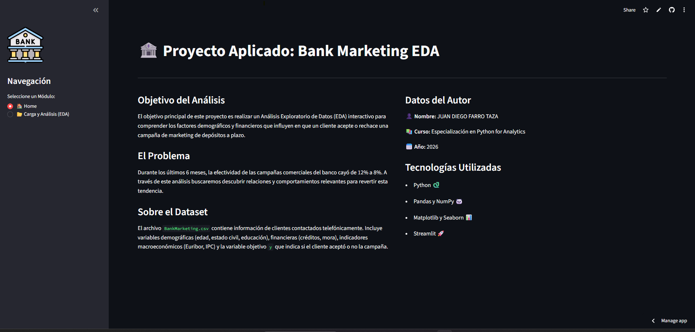
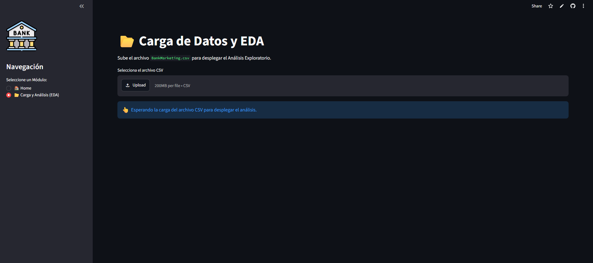
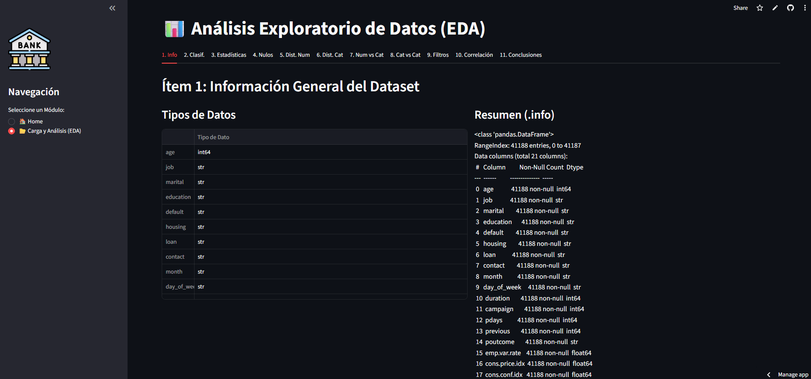

# 🏦 Análisis Exploratorio de Datos (EDA) - Bank Marketing

## 📖 Descripción del Proyecto
Este proyecto es una aplicación web interactiva desarrollada con **Streamlit** en Python. Su objetivo principal es realizar un Análisis Exploratorio de Datos (EDA) sobre el dataset `BankMarketing.csv`. 

El análisis busca comprender los factores demográficos, financieros y macroeconómicos que influyen en que un cliente acepte o rechace una campaña de marketing de depósitos a plazo. Esto responde a una necesidad de negocio: durante los últimos 6 meses, la efectividad comercial del banco cayó de 12% a 8%, y esta herramienta proporciona *insights* basados en datos para revertir dicha tendencia mediante segmentación y estrategias enfocadas.

**Datos del Autor:**
* **Nombre:** Juan Diego Farro Taza
* **Curso:** Especialización en Python for Analytics
* **Año:** 2026

---

## 📸 Capturas de la Aplicación


> *Vista general del Módulo 1: Contexto y objetivos del proyecto.*


> *Vista del módulo de carga del dataset.*


> *Vista del Módulo 2: Análisis Exploratorio Integrado y visualizaciones.*

---

## 🚀 Instrucciones de Ejecución Local

Para ejecutar esta aplicación en tu propia máquina, sigue estos pasos:

1. **Clonar el repositorio:**
   ```bash
   git clone [https://github.com/TU_USUARIO/TU_REPOSITORIO.git](https://github.com/TU_USUARIO/TU_REPOSITORIO.git)
   cd TU_REPOSITORIO
